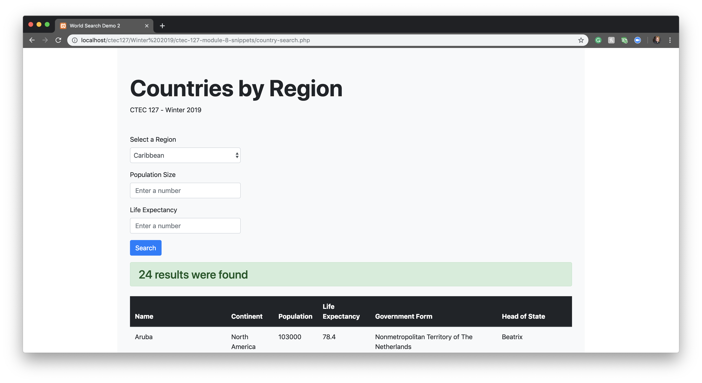
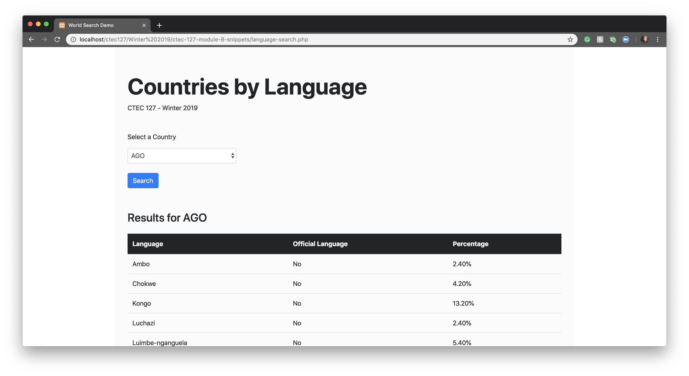

# CTEC 127 - Module 8 Code Examples

This repo contains two form samples and a corresponding database .sql file.

The SQL file will create a new database named world along with three tables. The three tables are:

- city
- country
- countrylanguage

Two PHP scripts that contain complete working code.

- country-search.php
- language-search.php

The examples use Bootstrap 4 and PHP Sticky Fields.

